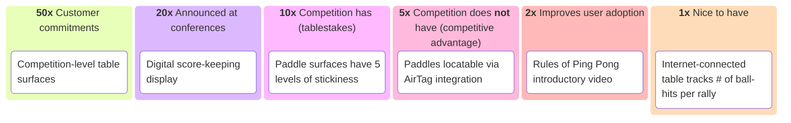
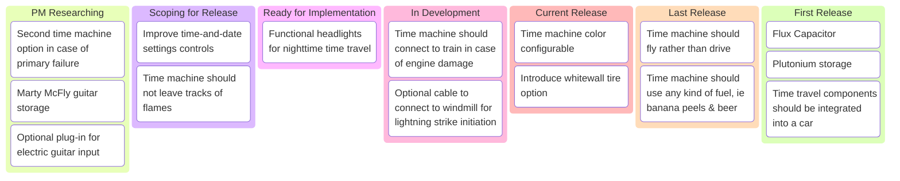

Ask most people what the number one responsibility of a product manager is, and they’ll usually say, “the PM owns the roadmap.”

This definition frustrates me a little bit, but there is a kernel of truth to it. The product manager is the one person who has the most influence over the roadmap, and in many ways is responsible for maintaining it.

It turns out roadmaps aren’t easy. And since we own it, we should apply some structure to the task, so that we can be consistent ourselves (ie, not re-inventing the roadmap every few months) as well as consistent across our organization. Pretty often, we product manage some aspect of a larger product - it’s essential that our casting of the roadmap is at least compatible with the other teams, or our combined roadmap presentation will be a cacophony.

Many PMs are over busy, and don’t set aside a lot of time for a thoughtful roadmap. I have worse news for these people - I believe that it’s best if PMs maintain **three** versions of the roadmap, and that’s reflected in the title of this post.

Quick overview:
1. Quantitative roadmap - your own worksheet that allows you to apply some formula to the conflicting priorities which allows you to focus on those things which are most urgent.
2. Kanban roadmap - this is an internal representation of the product past, current, and future. It must be fungible, but most importantly, this is the representation that puts the coming release in context.
3. Published roadmap - This is the final result of the above two processes, and is curated by the product team, and contains no internal information so that it can be consumed both by high-level execs, the field, and users of the product.

Let’s unpack this. Each of these roadmap isn’t an artifact, so much as it is a **tool**. That’s why roadmaps aren’t called out in the [Three-Fundamental-Artifacts][1] post. You can differ with me on this, it’s fine.

## Quantitative Roadmap

Tool: Spreadsheet

Quantitative roadmap should be Product Manager Lesson #1. Good product managers are nearly always swimming in data. That data can be twisted to support nearly any agenda. If there isn’t a consistent formula to compare all of the things the team could do, then over time, the data loses credibility because it's clear that the product manager is biased, and only collects data which supports their agenda.

Enter the quantitative roadmap. This allows you to apply weights to desires, based on an easily-understood formula, so that consumers of the roadmap can see the care and effort the PM has put into assembling an impartial scoring of all of the possible initiatives. The resulting ranking gives us all a good idea of what the most important things could be, but more importantly, allow us to discard the many things with relatively low scores. As mentioned in the book Farther, Faster and with Far Less Drama, giving ourselves permission not to constantly reanalyze low-priority items frees us to focus on the most important things.

Example ping pong supplier:

These weights are very generic. You can use them as-is, or you need to choose what formula makes sense for you. In a recent example from my history, the ranking of an OSS model on a leaderboard affects its prioritization - we only have so much capacity to optimize models, we might as well spend that time working on the most popular.

## Kanban-style Roadmap

Tool: Trello-style app

This next roadmap format is a really important tool to communicate, as a result of prioritization, when projects are likely to land. Just showing your stakeholders priority scores isn't very helpful - this representation takes into account the scope as provided by your product development team, so that you have a rough idea of which release each project will land.

I've used a Kanban-style to show this, both because it prevents people from asking for details many releases into the future (I can't predict that) and the simple Trello-style UX allows me to move cards around very easily. This representation has been a very powerful negotiation tool, imagine this scenario:

    I get a call from Richard, who is a Sales exec who is responsible the entire Northeast region. He's angry with me because I haven't prioritized Kevin's ask, and Kevin's on his team. Kevin has been complaining to Richard that the product team is blocking his big healthcare deal, and Richard wants to know why I'm not showing his team the love. "Let me quickly screenshare our planning roadmap," and I show him three major things all in one screen: Things we haven't sent for development yet, things that the product team is working on right now, or has released recently, and importantly, a reminder of the things we've shipped recently. By moving the cards around in real time with Richard, "OK, if I pop Kevin's ask into Ready for Implementation, making sure that the team will work on that next, then I'll have to pull something back to Scoping, and that will have to wait for the next release. Which of these things do you think is worth postponing in order to get Kevin's feature out ASAP?"
    
Nine times out of ten, Richard sees that we've done a good job of prioritizing, and that if we shuffle the order, it'll cost his greater team. On that last count, where Richard cares about Kevin and only Kevin, I can offer to escalate, "Kevin's asking us to give up a lot of opportunity. We should talk with leadership if this trade-off is really worthwhile." I can usually rely on my boss to be firm with a hothead, but you know, sometimes that healthcare deal really is strategic, and by escalating, we get permission to set aside our standard prioritization. By getting that mandate from leadership, we give the team something to rally around, "Let's go win that healthcare deal!"

- PM Researching: These are ideas that have come to us from all over, and we've accepted them as possible good ideas to include in the product, but either we don't know how, or haven't chosen to prioritze them yet. This list is in semi-priority order - don't put too much effort into A above B, just enough to give some order to the list. This is usually a pretty long list.
- Scoping for Release: The PMs have decided that an idea should be included in a release, but it's not ready yet. First we have to do research, decide on workflows, get feedback and approvals. etc. (See [Three-Fundamental-Artifacts][] for those steps.) By being in this colum, we're messaging to stakeholders, "this is important, we're putting time into the design, and it will appear in a coming release," without commiting us to a specific release.
- Ready for Implementation: The product and design team have done our job, this idea is now ready for final approval and will be picked up by the product development team for implementation "soon," again, without committing us to a specific release. If there's three quarters worth of ideas that are ready for implementation, then the stack will get shipped over three different releases. Beacuse of this, this list should be in strictly priority order. Whatever's at the top of the list is definitely going into the next release. The second item maybe, the third item, not so sure, and so on.
- In Development: The product development team has accepted the design, and is in active implementation. All of the artifacts which describe this work should be available to stakeholders - the PRD, the epics, the stories, whatever you have, make it clearly visible. This is your last chance to get validation that the team is doing this in a way which will be used by customers - get all the reassurance you can.
- Current Release, Last Release, N-1, N-2, etc.: I find it really helpful to show what we have shipped so far. Without this, it's hard to demonstrate momentum (or lack thereof). I really like to show at a high level, "OK, I know you're excited for your pet feature, but look at all the value the team has shipped! You know this team is reliable - if your idea is priortized here, you know it'll ship soon." Momentum builds confidence - make sure to demonstrate that momentum and get your team the recognition they deserve. Conversely, if you've never shipped anything yet, this is a great place to show people how risky things are, "This proejct is still in its early phases; we need to focus strictly on the most fundamental things, and make sure we build a good rhythm before we get excited about a thousand knobs and buttons. I need to keep the team focused on winning those first anchor customers; for that reason, I really need to keep your idea in the backlog."

## Published Roadmap

Tool: Slide deck

The first two are your planning tools. You use them with your teams and your stakeholders to set plans in motion. They've got a ton of confidential information in them, account for all sorts of internal dysfunction, etc.

Now go make a slide!

# One More Thing - A Note About Prioritization
Were I king of all product managers, I would make the following phrases illegal, “Customer Requirement,” “Must Have,” and P1 through P4. All of these things are sort of a cop-out for Product Management to shovel scope onto the product development team without regard to capacity.

Instead, I wish product management continually provided a list, “Here is a prioritized list of things we need to do together, from the most important to the least important. We need to ship on date X, how much of this can we get done?” The rest is down to negotiation and cutting scope. When we resort to words like, “must have,” we unintentionally move into burn-out culture, where we go from best effort to deliver at all costs. Those costs fall on the product development team. As a result, for fear of losing their jobs, the team will work all-hours, sacrifice time with their families, suffer little sleep, make poor decisions, and ultimately leave the organization as soon as they can find a more humane option.

It is a fundamental requirement of the product management function to provide a list of prioritized needs. Product management isn’t responsible for velocity, though. The only thing we are responsible for is analyzing the **impact** of the schedule, and escalating to leadership. “We are tracking to deliver X, Y, and Z. Without I, J, and K, we won’t be able to make these sales targets. If you want to continue to grow at the desired rate, work with the product development team to figure out how to increase velocity.”

[1]:	Three-Fundamental-Artifacts.md "Three Fundamental Artifacts"